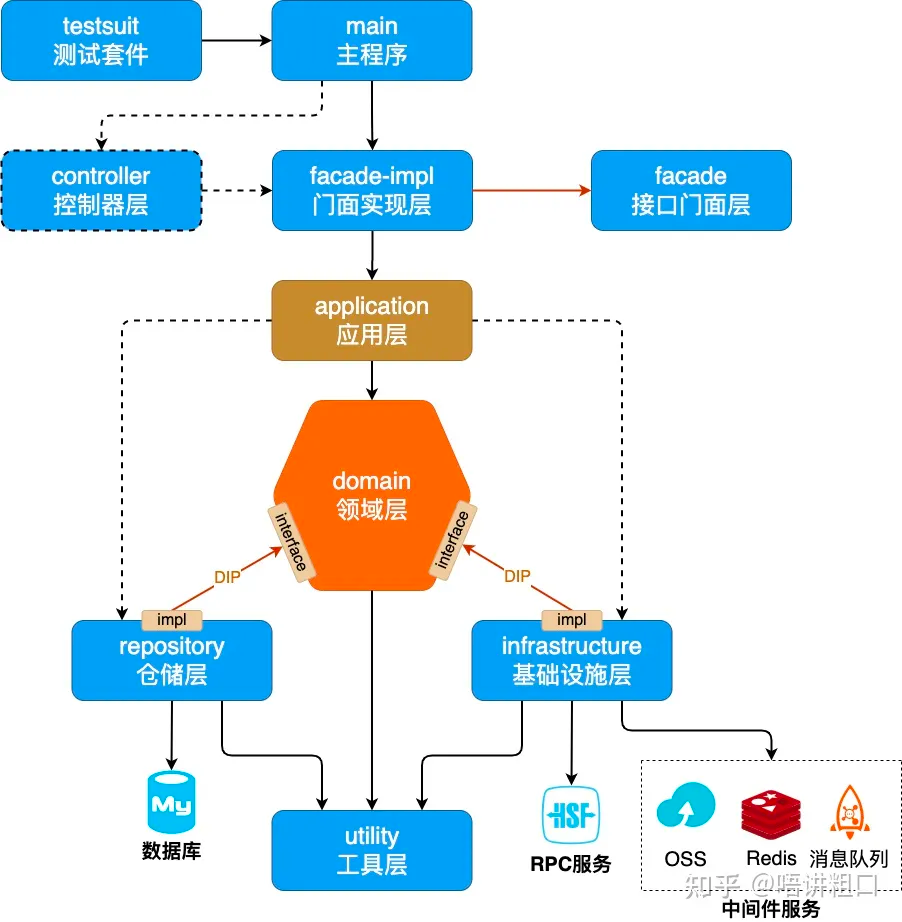

# gmail
前端代码地址：https://github.com/zhengpanone/gmall-ui-admin-vben
#### Description
学习yudao-cloud
```shell
mvn clean install -U -DskipTests
mvn clean install -Dmaven.test.skip=true
```

启动nacos
```shell
startup.cmd -m standalone
```

## 构建单个模块
-pl 是 Maven 的一个命令行参数，全称 --projects，用于在 多模块（multi-module）Maven 项目中指定要操作的模块。
```shell
mvn -pl module-a clean package
```

## DDD领域驱动
https://zhuanlan.zhihu.com/p/641295531
